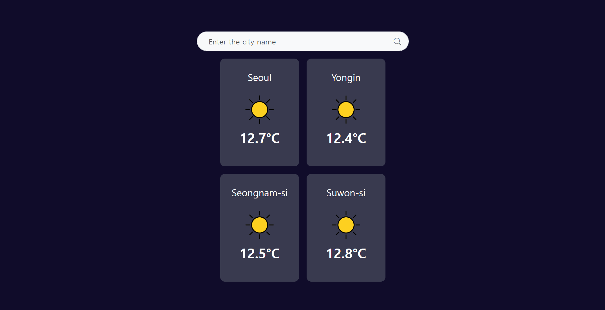
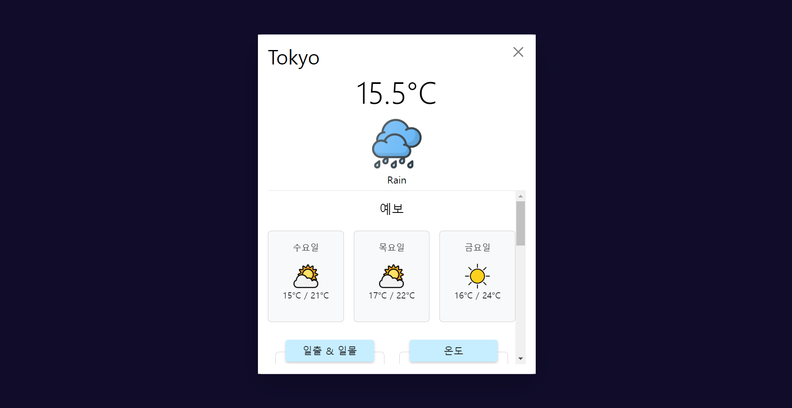

# 🌤️ Weather App 🌧️


## 🌟 프로젝트 개요

### 🎯 목표
OpenWeatherMap API를 통해 특정 도시의 실시간 날씨 정보를 제공하는 Vue.js 애플리케이션을 개발했습니다.<br><br>
사용자는 도시 이름을 검색하여 특정 도시의 날씨 정보를 실시간으로 확인할 수 있으며, 선택한 도시의 날씨 상세 정보는 모달 창을 통해 확인할 수 있습니다.

### 🛠️ 기술 스택
- **프론트엔드**: Vue.js, TypeScript, BootstrapVue
- **백엔드**: OpenWeatherMap API
- **도구**: Axios (HTTP 요청), Vite (빌드 도구)

## 🚀 주요 기능
- **🔍 날씨 검색 기능**: 사용자가 입력한 도시의 날씨를 조회할 수 있습니다.
- **🌡️ 날씨 데이터 표시**: 도시의 현재 날씨 정보를 카드 형식으로 표시합니다.
- **🗂️ 상세 날씨 정보 모달**: 클릭 시 상세한 날씨 정보를 보여주는 모달 창이 뜹니다.
- **📅 날씨 예보**: 선택한 도시의 3일간의 날씨 예보를 표시합니다.
- **🏙️ 기본 도시 날씨 조회**: 기본으로 설정된 도시들의 날씨를 자동으로 불러옵니다.

## 🛠️ 설치 및 실행 방법

1. **레포지토리 클론**
    ```bash
    git clone https://github.com/uhee01/good-weather.git
    cd good-weather
    ```

2. **의존성 설치**
    ```bash
    npm install
    ```

3. **API 키 설정**
    - `.env` 파일을 생성하고 OpenWeatherMap API 키를 설정합니다.
    ```env
    VITE_APP_WEATHER_API_KEY=my_api_key
    ```

4. **애플리케이션 실행**
    ```bash
    npm run dev
    ```

## 📸 스크린샷

### 🌐 메인 화면


### 🌦️ 상세 날씨 정보 모달


## 🛠️ 개발 과정

1. **프로젝트 설정 및 초기화**
    - Vite를 사용하여 Vue.js 프로젝트 초기화
    - BootstrapVue 및 Axios 설치 및 설정
    - OpenWeatherMap API 키 설정

2. **기본 레이아웃 및 스타일링**
    - 기본 레이아웃 구성 (전체 화면 배경, 중앙 정렬된 검색창 등)
    - Bootstrap을 활용한 스타일링

3. **검색 기능 구현**
    - 검색창 컴포넌트 구현 및 사용자 입력 처리
    - 검색 버튼 클릭 또는 엔터 키 입력 시 날씨 데이터를 불러오는 기능 구현

4. **날씨 데이터 조회 및 표시**
    - OpenWeatherMap API를 활용하여 날씨 데이터 가져오기
    - 가져온 데이터를 기반으로 날씨 카드 생성 및 표시

5. **상세 날씨 정보 모달 구현**
    - 날씨 카드 클릭 시 상세 정보를 보여주는 모달 창 구현
    - 모달 창에서 일출, 일몰, 기온, 기압, 습도 등의 상세 정보 표시

6. **날씨 예보 기능 추가**
    - 선택한 도시의 3일간의 날씨 예보 데이터를 API를 통해 가져오기
    - 예보 데이터를 모달 창에 표시

7. **에러 처리 및 사용자 피드백**
    - API 호출 실패 시 에러 메시지 표시

## ⚠️ 어려웠던 부분과 해결 과정

1. **API 호출 및 데이터 처리**
    - 처음에는 OpenWeatherMap API에서 가져온 데이터를 효과적으로 구조화하고 표시하는 데 어려움이 있었습니다. 이를 해결하기 위해 데이터 인터페이스를 정의하고, 각 도시의 날씨 데이터를 일관된 형식으로 저장하여 처리했습니다.

2. **모달 창 내 데이터 동기화**
    - 모달 창을 통해 상세 날씨 정보를 표시할 때, 데이터의 동기화 문제가 발생했습니다. 특히, API 호출이 비동기적으로 이루어지기 때문에 모달 창이 열리기 전에 데이터가 로드되지 않는 경우가 있었습니다. 이를 해결하기 위해 모달 창을 열기 전에 데이터를 미리 로드하고, 로딩 상태를 관리하여 사용자에게 로딩 스피너를 표시했습니다.

3. **다국어 지원**
    - 한국어와 영어를 동시에 지원하기 위해 API 호출 시 `lang` 파라미터를 설정하여 한국어 데이터를 가져오도록 했습니다. 이 과정에서 API 응답 형식이 일부 다를 수 있어 데이터를 처리하는 로직을 조정했습니다.

4. **반응형 디자인**
    - 다양한 화면 크기에서 애플리케이션이 잘 동작하도록 반응형 디자인을 구현하는 데 어려움이 있었습니다. 이를 해결하기 위해 Bootstrap의 그리드 시스템을 적극 활용하고, CSS 미디어 쿼리를 통해 다양한 화면 크기에서의 레이아웃을 조정했습니다.

